# 《Hello-Agents》第 1–4 章 · 25 分钟白板分享稿

> **主题**：从"会聊天"到"会干活"——智能体的第一性原理与三大经典范式
> **范围**：第 1 章 初识智能体 / 第 2 章 智能体发展史 / 第 3 章 大语言模型基础 / 第 4 章 智能体经典范式构建
> **形式**：白板手写（无 PPT）。全文 12 块板书，**净演讲 25:00**，Q&A 另计。
> **素材来源**：`D:\code\hello-agents`（datawhalechina/hello-agents）`docs/chapter1~chapter4` 原文，已逐条核对；配图取自原文 `docs/images/`，见第 5.5 节。

---

## 0. 讲前准备（5 分钟搞定）

**白板分区**（三栏式，全场不擦左侧）：

| 左栏（保留全场） | 中栏（每板擦写） | 右栏（保留全场） |
|---|---|---|
| **Agent Loop 闭环图**（板 2 画完后留到最后，每次提到"循环"就用手指一下） | 当前这板的图/表 | **"结论 / 坑"清单**（每讲完一章加一条，收尾直接用） |

**颜色约定**：黑＝结构骨架，蓝＝定义与关键词，红＝限制与坑，绿＝工程落地结论（绿字最后会被收尾直接复用）。

**必须提前写好的 3 个骨架**（省时间）：① 左栏 Agent Loop 大圆；② 中栏底部一条空白时间轴；③ 板 10 的对比表表头（6 行 × 4 列，画格子最费时间）。

**原文配图**：**28 张**原文配图已随文档打包在 `images/hello-agents/`（清单见 5.5 节）。**凡原文有图的板，优先投原文图**；板书图降级为两用——现场手画（建立"从零搭起来"的叙事感），或投屏/断网时兜底。板书与原文图不一致处，按各板下方的"注意"说明处理。

**📐 板书 vs 原文配图：哪些板可以直接投图**（全场 12 板逐板结论）

| 板 | 板书画的 | 原文对应图 | 替代策略 |
|---|---|---|---|
| 0 开场 | 聊天机器人 vs 智能体 | — | 无图，纯口播 |
| 1 定义 / 台阶 | 四要素 + 传统五级台阶 | 图 1.2 恒温器、图 1.3 决策曲线、图 1.4 三种知识表示、表 1.1 传统 vs LLM、表 1.2 PEAS（备选） | **图能覆盖大部分**（已插入）；但①"自主性"三个字图上没有 ②**五级台阶原文没有配图，必须手画** |
| 2 Agent Loop | 闭环 + Thought / Action / Observation | 图 1.5（同款闭环，且多了 Planning / Tool Selection / State Change）、图 2.10 组件架构 | 图能替代，但**建议仍手画**：要常驻左栏被反复指 |
| 3 Workflow vs Agent | 两栏对比 | 图 1.6 | **图直接替代**（已插入） |
| 4 发展史 | 时间轴 + 痛点链 | 图 2.1、2.4、2.6、2.9 为主，图 2.2 / 2.3 / 2.5 / 2.7 备选，另有图 2.8、2.11 | **图覆盖最全的一板**：时间线（2.11）+ 演进阶梯（2.1）可替代板书，四段口播各有对应图 |
| 5 LLM 演进 | N-gram → … → Decoder-Only + 注意力 | 图 3.1、3.2、3.3、3.4、3.5 | **几乎全可替代**：缺陷链的每一环都有图 |
| 6 六条结论 | 6 条文字清单 | 表 3.1 BPE 合并过程 | 清单只能手写；"分词是隐藏 bug"那条投表 3.1 |
| 7 ReAct | 循环图 + 代码 | 图 4.1 | 图能替代循环图，但**建议手画**（本场叙事高潮，"从零搭起来"） |
| 8 Plan-and-Solve | 两阶段 + 代码 | 图 4.2 | 图可替代（注意图含 Replan，书中代码是静态计划） |
| 9 Reflection | 三框环 + Memory | 图 4.3 | 图可替代（注意图是 Reflexion 通用架构） |
| 10 选型表 | 6 行对比表 | 图 4.4（表 4.1） | 图直接替代；要边讲边加箭头时仍建议手写 |
| 11 收尾 | 公式 + 落地清单 | 图 2.10 | 指回板 2 配图即可 |

**结论：但凡原文有图，就以原文图为主。** 只有三类例外值得动手画——

1. **必须手画的**：原文没有对应图的（板 1 的五级台阶、板 6 的六条清单）、要常驻白板被反复指的（板 2 左栏 Agent Loop）、要现场"从零搭起来"建立叙事感的（板 7 的 ReAct 三框循环）、要边讲边加箭头的（板 10 选型表）。
2. **优先投图的**：结构复杂、手绘费时且容易画歪的——决策质量曲线（图 1.3）、六维对比表（表 1.1）、演进阶梯（图 2.1）、Transformer（图 3.4）、多头注意力（图 3.5）、BPE 合并（表 3.1）。
3. **代价与折中**：投屏图翻页即消失、没法随手补箭头、投影与手写来回切换会打断节奏；图里的细节（英文标注、与本场无关的模块）还会抢注意力。**折中做法：结构用原图，标注用手写**——把图投出来，再在旁边加箭头写关键词（例如投图 1.5 时补一句"这里回边就是 Agent Loop 的关键"）。

> 一句话：**图当"证据 / 对照 / 省时间"，板书当"骨架 / 叙事"；原文有图就别自己画。**

**开场前默念三句话**：不念概念、念因果；每个术语都给一个类比；每章结束往右栏落一条可带走的结论。

---

## 1. 时间分配表（总 25:00）

| 板 | 内容 | 时间 | 时长 | 超时了怎么砍 |
|---|---|---|---|---|
| 0 | 开场钩子 | 00:00–01:00 | 1:00 | 不可砍 |
| 1 | 第 1 章：智能体是什么 | 01:00–03:00 | 2:00 | 砍"传统五级台阶"，只留定义 |
| 2 | 第 1 章：Agent Loop | 03:00–05:00 | 2:00 | 不可砍（全场锚点） |
| 3 | 第 1 章：Workflow vs Agent | 05:00–06:30 | 1:30 | 压缩成一句话对比 |
| 4 | 第 2 章：四次范式更替 | 06:30–10:00 | 3:30 | **首选砍这里**，压到 2:00（只讲痛点链） |
| 5 | 第 3 章：LLM 为何能当大脑 | 10:00–13:00 | 3:00 | 砍 QKV 细节，只留"开卷考试"类比 |
| 6 | 第 3 章：6 条工程结论 | 13:00–15:00 | 2:00 | 砍到 3 条（第 1/2/5 条） |
| 7 | 第 4 章：ReAct | 15:00–17:30 | 2:30 | 不可砍（全场高潮） |
| 8 | 第 4 章：Plan-and-Solve | 17:30–19:30 | 2:00 | 砍水果题演算 |
| 9 | 第 4 章：Reflection | 19:30–21:30 | 2:00 | 不可砍 |
| 10 | 第 4 章：三范式选型表 | 21:30–23:00 | 1:30 | 不可砍（收口） |
| 11 | 收尾 + 落地清单 | 23:00–25:00 | 2:00 | 不可砍 |

> **机动**：板 4 + 板 8 是两处"时间海绵"（合计可省 2:30）。宁可砍细节，不要砍板 2、7、10。

---

## 2. 逐板脚本

### 板 0 ｜ 开场钩子 ⏱ 00:00–01:00

**🖊 板书**

```
Q：给 ChatGPT 说"帮我规划一次厦门之旅，预算 5000"
   它给你一段漂亮的文字        ← 聊天机器人（说）
   还是真的把机票酒店查好订好？  ← 智能体（做）
【今天 25 分钟：智能体是什么 → 从哪来 → 大脑怎么工作 → 怎么亲手造一个】
```

**🎤 口播要点**

1. 一句话点题：**从"有问必答"到"自主行动"，中间隔着的就是"智能体"这三个字**。
2. 交代路线图：第 1 章定义与运行机制、第 2 章历史（为什么是今天这个样子）、第 3 章大脑（LLM 的哪些特性决定了 Agent 的上限）、第 4 章动手（三种必须会手写的经典范式）。
3. 承诺：**25 分钟只讲因果，不讲名词表；每个概念都配一张能画在白板上的图。**

**过渡句**："先回答最基础也最容易被含糊掉的问题——到底什么才算智能体？"

---

### 板 1 ｜ 第 1 章：智能体是什么 ⏱ 01:00–03:00

**🖊 板书**

```
        ┌──────── 环境 Environment ────────┐
        │                                  │
   传感器 Sensors ──▶ 【 智能体 Agent 】 ──▶ 执行器 Actuators
        │                  ▲               │
        └── 观察 Observation ─┘     行动 Action
                    真正赋予"智能"的是：自主性 Autonomy
                    执行器可以是机械臂，也可以只是"调一个 API"

传统智能体的五级台阶（人类先验知识写进去的）：
简单反射(恒温器) → 基于模型(世界模型) → 基于目标(GPS+A*) → 基于效用(时间/油耗/避堵) → 学习型(RL / AlphaGo Zero)
                                                                              ↑ 学习是"元能力"
```

**🖼 原文配图**

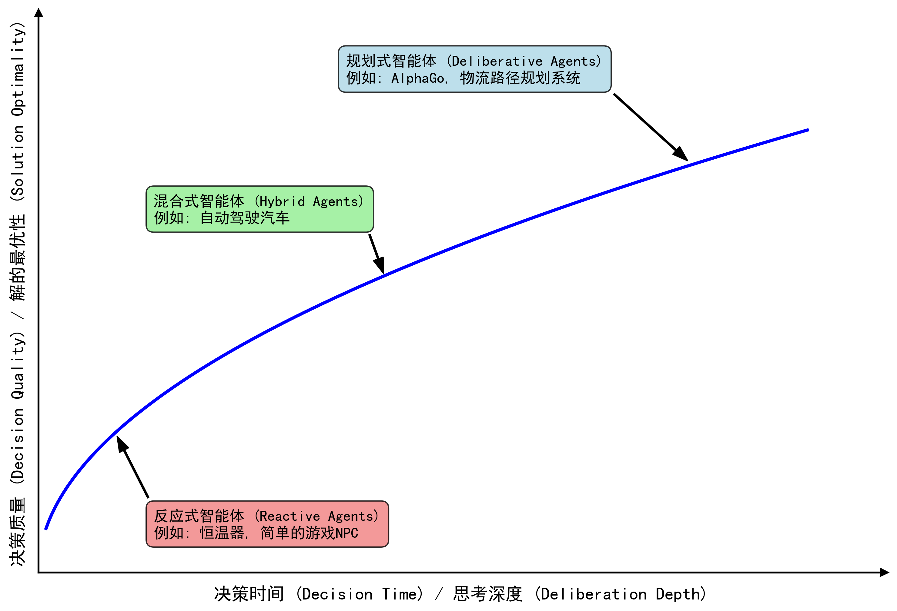
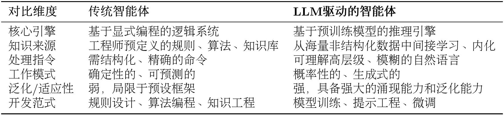

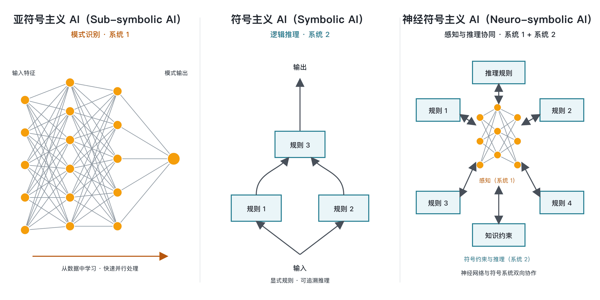

> 备选：表 1.2（PEAS：性能度量 / 环境 / 执行器 / 传感器）本场没展开，被问到"怎么定义任务环境"时可直接投。

**🎤 口播要点**

1. 定义四要素：传感器、环境、执行器、行动——**关键在"自主"两个字**：不是被动响应刺激、不是严格执行预设指令，而是基于感知与内部状态独立决策。
2. 五级台阶快速带过（20 秒）：恒温器（若室温高于设定值就制冷）→ 隧道里摄像头看不到前车、但内部**世界模型**还记得那辆车 → GPS 用 **A\*** 规划最优路径 → 时间/油耗/避堵多目标权衡 → **AlphaGo Zero** 靠自我对弈发现超越人类的策略。
3. 分类不必展开，只留两个记忆点：**反应式（安全气囊毫秒级）vs 规划式（棋手想十几步）是权衡，不是高低**；LLM 智能体是**神经符号主义**的实践——内核是神经网络，但"思想、计划、API 调用"都是明确符号。
4. 落到第 1 章的结论：**能力来源变了**——从"工程师显式编程"变成"预训练得到隐式世界模型 + 涌现能力"。

**🔑 记忆点**：*智能体 = 感知 + 自主决策 + 行动；"自主"是它和脚本的分界线。*

**❓ 可能追问**：智能体必须有物理身体吗？——不必，虚拟工具（调 API、执行代码）同样是执行器。

---

### 板 2 ｜ 第 1 章：Agent Loop（全场锚点） ⏱ 03:00–05:00

**🖊 板书**（画完留到收尾）

```
                     ┌──────────── 观察 Observation ◀──── 环境状态变化
                     ▼                                      ▲
        感知 Perception ─▶ 思考 Thought ─▶ 行动 Action ──────┘
                              │  ├─ 规划 Planning
                              │  └─ 工具选择 Tool Selection
                              ▼
                        LLM = 大脑（决策引擎）

   输出协议（结构化，才能被程序解析）：
     Thought      : 用户想知道北京天气，我需要调用天气工具
     Action       : get_weather("北京")
     Observation  : 北京当前晴，25℃，微风
   ★ 行动不是终点：观察才是下一轮的起点（闭环，不是直线）
```

**🖼 原文配图（可投屏 / 打印）**


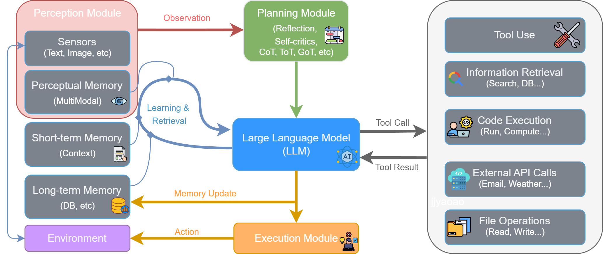

**🎤 口播要点**

1. 这个循环叫 **Agent Loop**，是全书的地基：感知 → 思考（规划 + 工具选择）→ 行动 → 环境状态变化 → 新观察 → 回到起点。
2. 强调那个**回边**：很多人第一次写 Agent 会写成一条直线（问 → 想 → 答），一加回边就活了：模型能看见自己上一步干了什么。
3. 讲"协议"这一段：`Thought / Action / Observation` 不是文艺表达，而是**给 Parser 的契约**——`Action: get_weather("北京")` 被外部解析器正则抓出来执行，然后把 JSON 结果**改写成人话**回灌成 `Observation`（原文：感知系统的职责就是把机器可读数据转写成自然语言观察）。
4. 顺带点出环境的四个特性，解释"为什么需要记忆和护栏"：**部分可观察**（航班 API 只给你一部分）、**随机**（两次查票价可能不同）、**多智能体**（别人也在抢票）、**序贯且动态**。

**🔑 记忆点**：*Agent Loop = 感知→思考→行动→观察；`Thought/Action/Observation` 是人与机器共用的协议。*

**❓ 可能追问**：循环会不会停不下来？——第 4 章会看到，代码里必须自己写 `max_steps` 安全阀。

---

### 板 3 ｜ 第 1 章：Workflow vs Agent ⏱ 05:00–06:30

**🖊 板书**

```
Workflow（预先编排的静态流程图）
  报销审批：提交 → 金额<500? → 部门经理 : 部门经理+财务总监 → 打款
  每一步、每个判断条件都被预先设定

Agent（目标导向、动态推理）
  "查今天北京天气，再推荐一个景点"
  → 拆解：① 查天气 ② 按天气选景点 → 调 API → "晴天适合户外" → 推荐颐和园
  ★ 全程没有任何写死的 if 天气=晴天 then 推荐颐和园

一句话：Workflow 让 AI 按部就班执行指令；Agent 给 AI 自由度去自主达成目标
```

**🖼 原文配图**

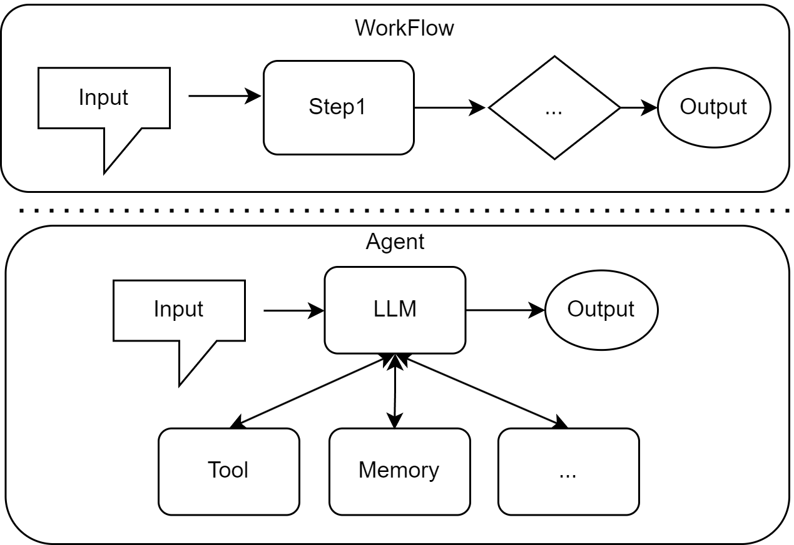

**🎤 口播要点**

1. 这是全书最实用的一张对照表，也是团队最容易踩的坑：**很多号称 Agent 的系统其实是 Workflow**。
2. 落一条绿色结论（写进右栏）：**流程明确、异常可枚举 → 用 Workflow（便宜、稳定、可测试）；必须基于实时信息动态决策 → 才上 Agent。**
3. 提一下协作模式的两种形态：作为**开发者工具**（Copilot / Claude Code / Cursor）和作为**自主协作者**（CrewAI / MetaGPT / LangGraph 等），后者是我们后面要自己造的。

**过渡句**："理解了 Loop，下一个问题自然是：这条路是怎么走到今天的？为什么不是符号主义赢了？"

---

### 板 4 ｜ 第 2 章：四次范式更替 ⏱ 06:30–10:00

**🖊 板书**（一条时间轴 + 一条痛点链，时间轴骨架可提前画）

```
1966        1968-70      70s-80s        1986          80s→2016        2010s        2020s
ELIZA  →   SHRDLU   →   MYCIN/专家系统 → 心智社会  →  联结主义+RL  →  预训练    →  LLM 智能体
模式匹配    积木世界      600条 IF-THEN    去中心化      TD-Gammon      自监督      工具+记忆+
文本替换    (语言+规划+   反向链 CF∈[-1,1]  涌现/协作     →AlphaGo      预测下一词   感知-思考-行动
            记忆闭环)
 韦泽鲍姆    威诺格拉德    纽厄尔&西蒙PSSH  明斯基       辛顿等/2016     GPT系列     2024 Letta技术栈

痛点链（每次更替都是被上一代的痛逼出来的）：
无语义/无状态 ─→ 知识获取瓶颈·常识·框架问题 ─→ 只会感知不会序贯决策 ─→ 缺先验知识、要海量交互 ─→ 幻觉
```

**🖼 原文配图**

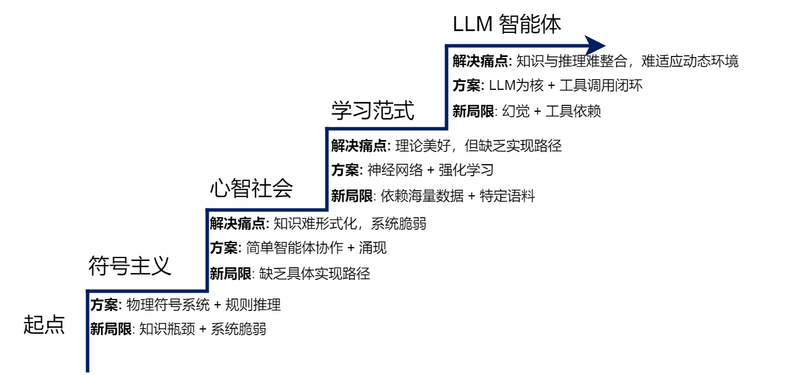
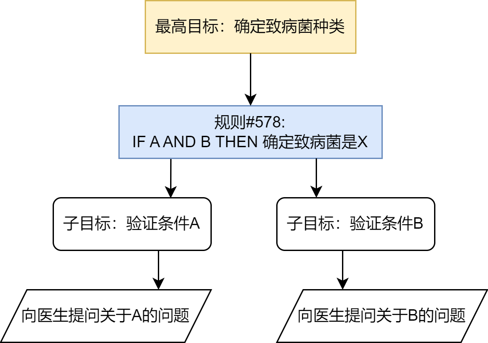
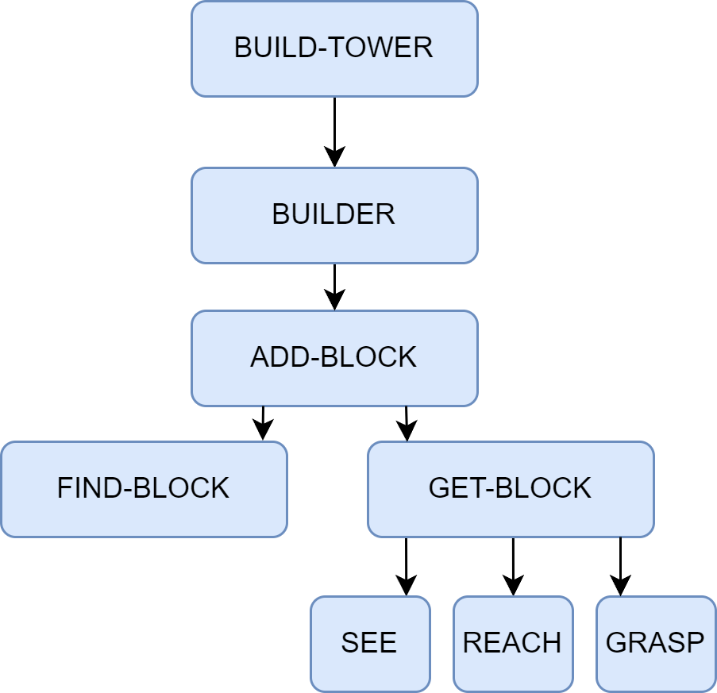
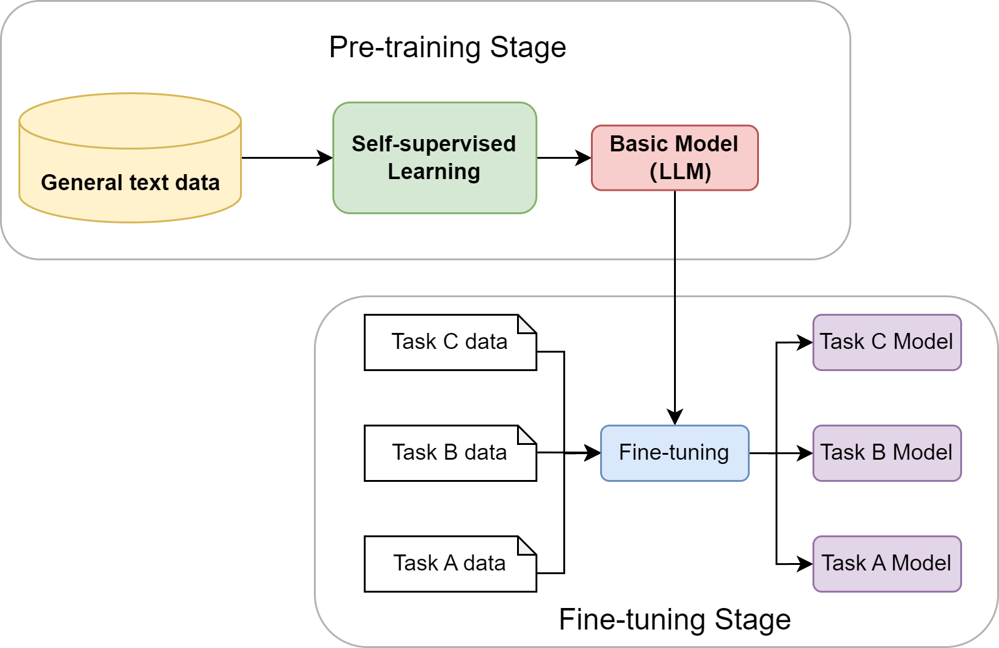
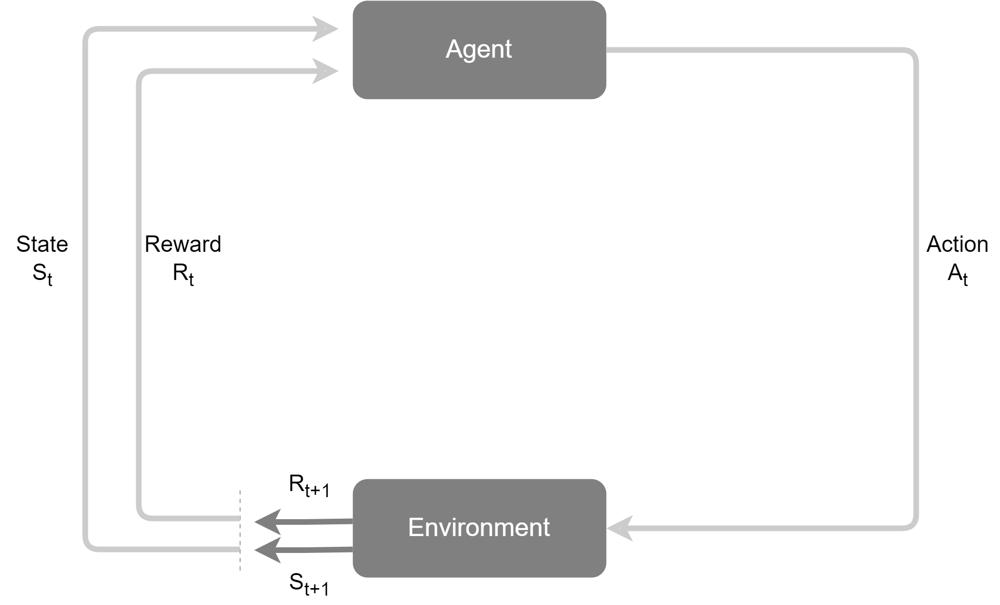
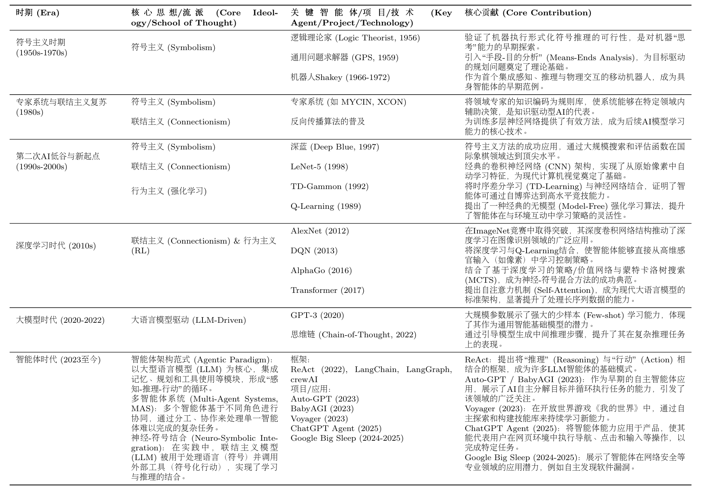

> 备选：图 2.2 物理符号系统的构成元素、图 2.3 专家系统的通用架构、图 2.5 SHRDLU 的"积木世界"交互界面、图 2.7 符号主义 vs 联结主义范式对比（后两张文件较大，见 5.5 图库）。

**🎤 口播要点**

1. 先立规矩：**这不是技术编年史，而是一条"问题驱动"的迭代链——每个新范式都是为了解决上一代的核心痛点，同时又带来新局限。**
2. 四个必讲画面（每个 30 秒）：
   - **ELIZA（1966）**：只有模式匹配 + 代词转换（I→you、my→your、am→are），从不正面回答，只把陈述变提问。魏泽鲍姆本想证明"机器完全不理解内容也能伪装智能"，结果连秘书都产生了情感依赖——这就是 **ELIZA 效应**：智能是人的投射。
   - **SHRDLU / MYCIN**：符号主义的巅峰与天花板。MYCIN 用约 600 条 IF-THEN 规则 + 反向链 + 置信因子 CF（-1~1）在血液感染诊断上达到专家水平；但它暴露了三个致命难题：**知识获取瓶颈**（专家直觉写不成规则）、**常识问题**（"水是湿的"也要编码）、**框架问题**（动作后怎么知道什么没变）。
   - **明斯基《心智社会》(1986)**：智能来自大量"无心"的简单智能体协作与**涌现**——`GRASP` 只管抓握、根本不知道什么叫"塔"，靠去中心化的激活/抑制信号搭出塔来。这是多智能体系统的思想源头。（金句可原样引用："What magical trick makes us intelligent? The trick is that there is no trick."）
   - **学习范式 → LLM**：强化学习闭环（状态 S → 策略 π → 行动 A → 奖励 R → 更新策略，目标是**累积回报**，所以要像围棋"弃子"一样有远见）→ 预训练-微调把"手工编码世界"换成"压缩的隐式世界模型"，涌现出上下文学习与思维链。
3. 收口用一句话：**过去 60 年，AI 一直在回答"知识从哪来、决策怎么做"；LLM 第一次让这两件事同时便宜了。**

**🔑 记忆点**：*符号给逻辑、联结给学习、RL 给决策、预训练给知识——今天的 Agent 是四者的合流。*

**❓ 可能追问**：明斯基的"智能体"是今天说的 Agent 吗？——不是。它极简单、专门化、自身"无心"，讲的是**组织原理**，所以 LLM 的出现并不推翻它。

---

### 板 5 ｜ 第 3 章：LLM 为什么能当大脑 ⏱ 10:00–13:00

**🖊 板书**

```
N-gram ──▶ 词嵌入/NNLM ──▶ RNN/LSTM ──▶ Transformer ──▶ Decoder-Only
数频率     连续向量        隐藏状态      自注意力·可并行   自回归"预测下一个词"
P(连乘)    king-man+       梯度消失      2017 谷歌         掩码：不许看未来
≈0.167     woman≈queen    只能串行                        → 训练方式=生成方式

Attention = softmax(Q·Kᵀ / √d_k) · V
  Q=你要查的问题   K=资料标签   V=资料内容   √d_k=稳压器
  比喻：注意力 = 开卷考试；Decoder-Only = 文字接龙
  没有位置编码，"agent learns" 和 "learns agent" 完全等价
```

**🖼 原文配图**


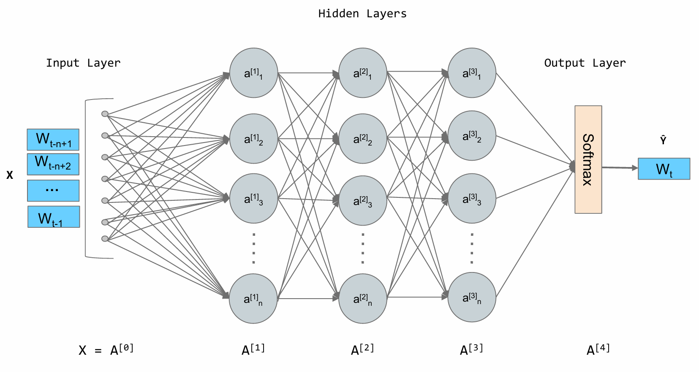

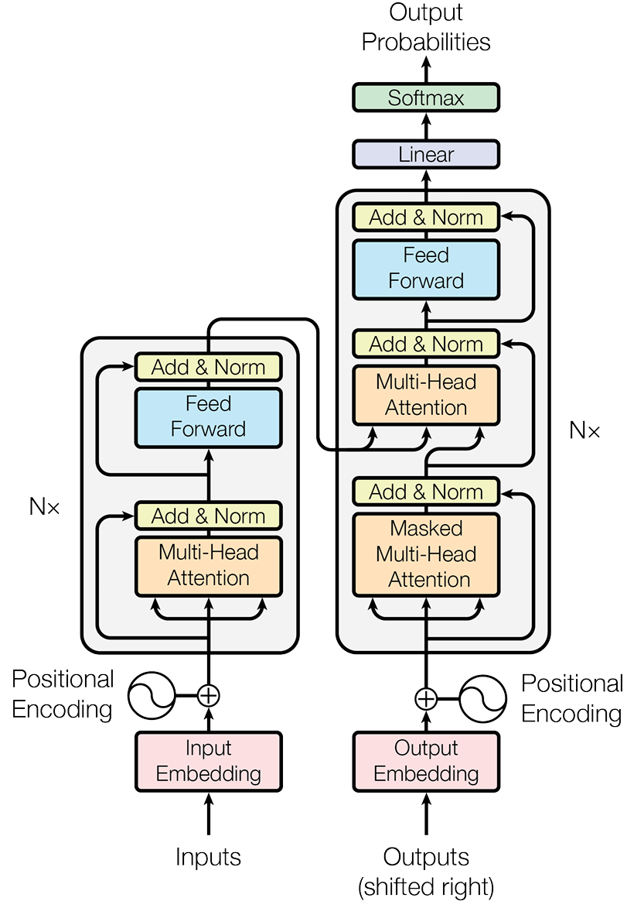
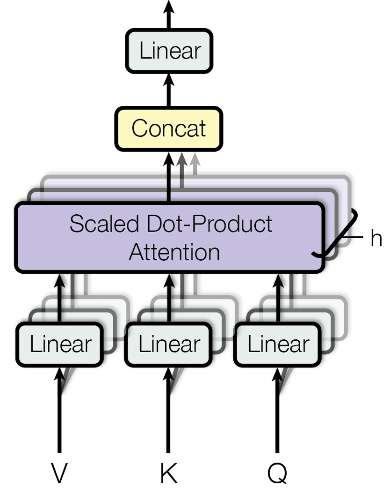

**🎤 口播要点**

1. 用一句"缺陷链"讲完演进：N-gram 只会数频率（原文例题 `datawhale agent learns` ≈ 2/6 × 2/2 × 1/2 ≈ **0.167**，没见过的组合概率直接为 0）→ 词嵌入把词变成连续向量（`king - man + woman ≈ queen`）→ RNN 用隐藏状态当短期记忆但只能串行、梯度消失 → Transformer **彻底抛弃循环、全靠注意力**，第一次做到真正并行。
2. 只讲一个公式，用类比讲：**注意力是开卷考试**——Q 是你要查的问题，K 是每份资料的标签，V 是资料内容，`√d_k` 是防止分数过大的稳压器。书上那句"`it` 指代 `agent` 的注意力权重最高"就是这张图的落点。
3. **Decoder-Only 是文字接龙**：给 `Datawhale Agent is` → 猜 `a` → 拼回去 → 猜 `powerful`……因果掩码保证"训练时偷偷并行看全文、但遮住未来"与"推理时未来还不存在"两件事行为一致。
4. 收到 Agent 上：**这三件事解释了第 4 章所有范式的可行性**——先想一步再调工具（指令遵循 + 少样本 + CoT）、工具结果拼回上下文（自回归）、反思其实是让模型检查自己的推理链。

**🔑 记忆点**：*LLM 是一个"预测下一个词元"的自回归概率模型；注意力让它开卷考试，掩码让它只能看左边。*

---

### 板 6 ｜ 第 3 章：6 条工程结论 ⏱ 13:00–15:00

**🖊 板书**（这一栏直接进右栏绿色清单）

```
1 上下文窗口按 Token 算，不是字数（8K/128K）→ 工程核心是裁剪/摘要/检索重拼
2 采样参数：工具调用用 T≈0、k=1，Agent 里"可复现"比"有创意"重要
3 提示工程是工程手段：要 JSON 就给 JSON 示例；一句"请一步一步思考"= CoT
4 分词是隐藏 bug：`2 + 2` 会算，`2+2` 可能算错；解析输出别假设字符级一致
5 幻觉是自回归的固有属性，不是偶发故障 → 只能外挂缓解（RAG/工具/多步验证）
6 能力涌现：CoT、指令遵循、多步规划要到数百亿~千亿参数才显著
   → 基座规模决定 Agent 上限（Chinchilla：70B 用 4 倍数据反超 175B GPT-3）
```

**🖼 原文配图**

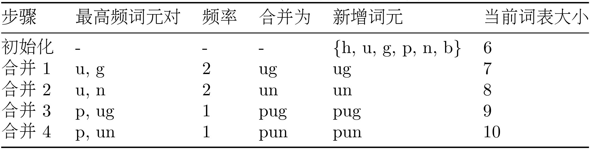

**🎤 口播要点**

1. 这 6 条是"听完今天就能改代码"的部分，逐条一句话，不展开。
2. 重点砸两条：
   - **第 2 条**：Agent 里 temperature 设高是灾难——同样的输入每次走不同分支，线上问题无法复现。原文的 `HelloAgentsLLM.think()` 就是 `temperature=0`。
   - **第 5 条**：这一条是**整个智能体行业的立足点**——幻觉来自训练数据脏 + 自回归没有事实核查 + 长推理链出错，三层缓解里只有"推理与生成层"（RAG、外部工具、多步验证）是应用开发者能做的，而这正好就是 Agent。
3. 收一句：**"裸 LLM 的上限是文字，Agent 的价值是把它接到事实和工具上。"**

**🔑 记忆点**：*窗口按 Token、参数求确定、幻觉靠外挂、能力靠基座。*

---

### 板 7 ｜ 第 4 章：ReAct（边想边做） ⏱ 15:00–17:30

**🖊 板书**

```
                    ┌─────────────── History: (a₁,o₁) … (aₜ,oₜ) ─────────────┐
                    ▼                                                        │
  Question q ──▶ LLM π ──▶ Thought thₜ ──▶ Action aₜ ──▶ Tools T ──▶ Observation oₜ
                                                            │
  (thₜ,aₜ) = π(q, 历史)        出口：Action = Finish[答案]    oₜ = T(aₜ)
  安全阀：while step < max_steps(默认 5)，超限返回 None

  代码骨架：
    for step in range(max_steps):
        prompt = TEMPLATE.format(tools, question, history)   # 历史进提示词
        text   = llm.think(...)                             # temperature=0
        thought, action = parse(text)                       # 正则切分
        if action.startswith("Finish"): return ...
        obs = tools[name](arg)
        history += [f"Action: {action}", f"Observation: {obs}"]   # ★ 闭环关键
```

**🖼 原文配图**


**🎤 口播要点**

1. 先讲它解决了什么：在 ReAct（Yao, 2022）之前，"纯思考"（CoT）容易事实幻觉、无法交互，"纯行动"没有规划和纠错能力。ReAct 的洞察是——**思考与行动相辅相成：推理让行动有目的，行动为推理提供事实依据。**
2. 举个书里的例子：问"华为最新手机是哪一款？"——模型第一步 `Thought` 就承认自己知识库没有 → `Action: Search[...]` → `Observation` 返回网页摘要 → 第二步综合出答案并 `Finish`，**两步收敛**。
3. 三个必须讲的工程细节：
   - **没有天然出口**：`max_steps` 安全阀（默认 5）是防死循环的护栏；
   - **工具描述（Description）是最关键的字段**：LLM 只能靠它选工具，写得含糊就等于选错工具；
   - **工具报错不要抛异常，要当成 Observation 回灌**（原文把"未找到名为 xxx 的工具"作为观察返回），让模型自己纠正。
4. 局限要讲透（右栏红字）：强依赖模型能力、每步一次调用导致延迟与成本、**提示词极其脆弱**（格式约束既是稳定来源也是最脆的耦合点）、缺乏全局规划易"原地打转"。

**🔑 记忆点**：*ReAct = 环境适应性 + 动态纠错；像循着蛛丝马迹随时改方向的侦探。*

**❓ 可能追问**：正则解析失败怎么办？——打印格式化后的完整提示词 + 模型原始输出，先分清是"模型不守格式"还是"解析写错"；必要时加 few-shot 示例。

---

### 板 8 ｜ 第 4 章：Plan-and-Solve（先谋后动） ⏱ 17:30–19:30

**🖊 板书**

```
① Planning：Planner(q) ──▶ P = [p₁, p₂, p₃, …, pₙ]      ← 一次 LLM 调用，输出 Python 列表
                            强制格式 ```python [...]``` + ast.literal_eval（比解析自然语言稳）

② Solving： for pᵢ: Executor(q, P, history) ──▶ sᵢ
                       history += sᵢ                    ← 唯一回边：回的是历史，不是重新规划

   实例（水果题）：周一 15 → 周二 15×2=30 → 周三 30-5=25 → 求和 70
   代价：2+n 次调用；计划静态，中途失败无法重规划，规划错则全程错
```

**🖼 原文配图**


> 注意：原文这张图是**含 Replan 的一般化流程**，而书中第 4.3 节的代码实现是**静态计划**（规划一次、不再重规划）——讲的时候可以借这张图说明"还可以更好"。

**🎤 口播要点**

1. 用原文的比喻开场：**ReAct 是循着蛛丝马迹随时改方向的侦探，Plan-and-Solve 是动工前先画完蓝图、再按蓝图施工的建筑师。**
2. 讲清"解耦"的价值：CoT 在多步复杂问题上容易偏离轨道；先一次性产出结构化计划（还能被代码审计），再逐条执行，**结构性和稳定性**是它的卖点。
3. 演示水果题：计划器输出 4 步列表，执行器逐步算出 15 → 30 → 25 → **70**，每一步都把"已完成步骤 + 结果"塞进下一次提示词（这就是最早期的状态管理）。
4. 坦率讲代价：**计划是静态的**——书上这个实现不做重规划，一旦第 2 步错，后面全错；解析失败直接返回空列表、整个任务终止。

**🔑 记忆点**：*Plan-and-Solve = 结构性 + 稳定性；先规划后执行，代价是"计划不可改"。*

---

### 板 9 ｜ 第 4 章：Reflection（事后自省） ⏱ 19:30–21:30

**🖊 板书**

```
   Task ──▶ Executor(初稿) ──▶ Reviewer(反思) ──▶ Refiner(优化) ──▶ 回到 Executor
                  │                 │                  │
                  └────────── Memory（execution / reflection 轨迹）──────────┘
                              评审维度：事实性错误 / 逻辑漏洞 / 效率问题 / 遗漏信息
   终止：if "无需改进" in feedback → break        兜底：max_iterations = 3

   实例（找 1~n 素数）：试除法 O(n√n) ──反思──▶ 埃氏筛 O(n log log n) ──第2轮──▶ "无需改进"
   ★ 每绕一圈 ≈ 2 次 LLM 调用（反思+优化），全串行 → "以成本换质量"
```

**🖼 原文配图**

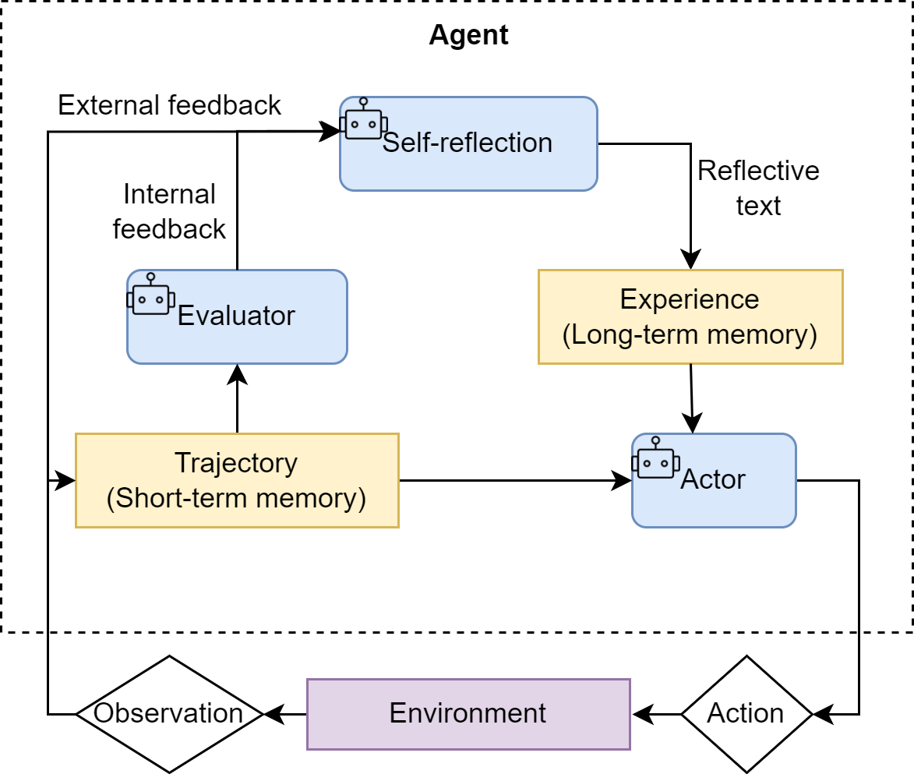

> 注意：原文这张图来自 Reflexion 论文的通用架构（含 Evaluator / 短期记忆 Trajectory / 长期记忆 Experience），比书中代码实现（Memory 存 execution + reflection 两类记录）更完整。

**🎤 口播要点**

1. 定位：给智能体加一个**事后自我校正循环**——执行 → 反思 → 优化，像人写完初稿要校对、解完题要验算。
2. 关键是**反思提示词的质量**：书里把它写成"极其严格的代码评审专家和资深算法工程师，专注算法效率瓶颈"，并要求"**只有**算法层面已达最优，才能回答'无需改进'"。结果：初稿试除法被指出瓶颈 → 改用埃氏筛 → 第二轮承认"无需改进"并终止。
3. 立刻讲成本收益（这是听众最关心的）：**每轮至少多 2 次 LLM 调用且完全串行**，不适合实时场景；换来的是方案质量从"合格"到"优秀"的**阶梯式提升**。书上的结论就是一句话——**"以成本换质量"**。
4. 顺手埋钩子：Reflection 里的 `Memory` 只是**短期记忆**（把轨迹序列化进提示词）；把这条线拉长，就是第 8 章的记忆与第 9 章的上下文工程；而"一个模型分饰执行者/评审员/优化者"正是多智能体的雏形。

**🔑 记忆点**：*Reflection = 质量跃迁；越改越好和越改越差之间，只隔着一个"严格的评审标准 + 终止条件兜底"。*

**❓ 可能追问**：怎么防止它越改越差？——三条：评审提示词要具体到维度、终止判据要用模型自己判断"无需改进"、外面必须套 `max_iterations` 兜底。

---

### 板 10 ｜ 第 4 章：三范式选型表 ⏱ 21:30–23:00

**🖊 板书**（表头提前画好）

```
                 ReAct              Plan-and-Solve        Reflection
一句话           边想边做            先谋后动               事后自省
循环             Thought→Action     ①规划(1次) + ②执行   执行→反思→优化
                 →Observation       (n 次，静态计划)       (≤3 轮，可提前收敛)
要工具吗         必需（手脚）        本例不需要             不需要（要 Memory）
Token 成本       高（每步1次调用）    中（2+n）             最高（初稿 + 每轮2次）
典型失败         格式解析失败/        计划错则全程错/        反思空洞或误判→越改越差/
                 原地打转/局部最优    无法重规划             成本失控
定位             环境适应 + 动态纠错  结构 + 稳定            质量跃迁
代表场景         查"最新手机/天气"    多步数学应用题          代码/报告的质量优化
```

**🖼 原文配图**


**🎤 口播要点**

1. 强调这张表是**选型决策表**，不是知识表：先问"这个任务要的是**探索**、**稳定**还是**质量**"。
2. 给一句最能落地的话：**范式可以叠加**——Plan-and-Solve 做规划、ReAct 逐步执行、Reflection 做终检；书里第 13~15 章的实战项目就是这种组合。
3. 补一个判断口诀：**要外部实时信息 → ReAct；逻辑路径确定、推理密集 → Plan-and-Solve；质量/正确性优先且能接受延迟与成本 → Reflection。**

**🔑 记忆点**：*三种范式 = 三种"思考与行动的组织方式"，选型先问任务的痛点在哪。*

---

### 板 11 ｜ 收尾：一页总结 + 落地清单 ⏱ 23:00–25:00

**🖊 板书**

```
        Agent = LLM（大脑） + Loop（范式） + Tools（手脚） + Memory/Context（视野）

三句带走：
 ① 定义：智能体 = 感知 + 自主决策 + 行动；Loop 是它的心跳
 ② 大脑：LLM 是自回归"预测下一个词"，所以幻觉是固有属性 → Agent 的价值是接到事实与工具
 ③ 范式：ReAct 探索 / Plan-and-Solve 稳定 / Reflection 质量；能写死流程的，就别上 Agent

落地清单（明天就能用）：
 □ 给循环加 max_steps 安全阀           □ 工具 Description 当 API 文档来写
 □ 工具报错回灌成 Observation           □ 工具调用 temperature=0
 □ 上下文按 Token 做预算：裁剪/摘要/检索  □ 先 Workflow，不够用再升级 Agent

延伸路线（本书后 12 章）：内存与上下文 8-9 → 通信协议 MCP/A2A 10 → RL 11 → 评估 12 → 实战 13-16
```

**🖼 收尾可回到图 2.10**（板 2 配图）：`Agent = LLM + Loop + Tools + Memory` 就是那张原文架构图的四个模块。

**🎤 口播要点**

1. 回到开场那个问题：ChatGPT 给你一段文字，Agent 把它变成行动——**差别就在这四件东西**。
2. 把右栏绿色清单念一遍（一整场的积累，收尾复用，听众会觉得"东西都在这里了"）。
3. 用一条工程判断收尾：**"能用 Workflow 解决的，不要用 Agent；一旦任务真的需要基于实时信息动态决策，今天的四种东西（Loop + LLM + 工具 + 记忆）就是最小可行骨架。"**
4. 邀请提问，并主动抛一个引子问题（防止冷场）："大家觉得我们现在的哪块业务最适合先上 ReAct？"

---

## 3. 板书速查卡（临场瞟一眼 · 可打印成 A4）

```
板1 智能体：环境｜传感器→【自主】→执行器｜五级台阶：反射→模型→目标→效用→学习
板2 Agent Loop：感知→思考(规划+选工具)→行动→观察↺ ｜ Thought/Action/Observation 协议
板3 Workflow=静态流程图（报销） vs Agent=动态推理（晴天推颐和园，无 if）
板4 发展史：ELIZA→SHRDLU→MYCIN→心智社会→联结+RL→预训练→LLM ｜ 痛点链是主线
板5 LLM：N-gram→嵌入→RNN→Transformer→Decoder-Only ｜ 注意力=开卷考试 ｜ 掩码=不许看未来
板6 六条：Token 预算｜T≈0｜提示工程｜分词坑｜幻觉靠外挂｜涌现→基座定上限
板7 ReAct：Thought→Action→Observation ↺ History｜Finish 出口｜max_steps 护栏｜description 决定选工具
板8 Plan-and-Solve：Planner→列表 P｜Executor 逐条 + history｜静态不可重规划
板9 Reflection：执行→反思→优化 ↺ Memory｜"无需改进"终止｜试除法→埃氏筛｜以成本换质量
板10 选型：探索→ReAct｜稳定→Plan-and-Solve｜质量→Reflection（可叠加）
板11 收尾：Agent = LLM + Loop + Tools + Memory｜六条落地清单
```

---

## 4. Q&A 备战（30 秒一答）

| # | 可能的问题 | 30 秒答法 |
|---|---|---|
| 1 | ReAct 和思维链（CoT）什么区别？ | CoT 只思考不行动，无法与外部世界交互、易事实幻觉；ReAct 用 `Observation` 把推理锚定在真实事实上，所以要工具。 |
| 2 | Agent 会死循环吗？怎么防？ | 会。三道防线：提示词里给 `Finish` 出口、代码里 `max_steps` 安全阀（书里默认 5）、工具报错以 `Observation` 回灌让模型自我纠正。 |
| 3 | temperature 怎么设？ | Agent 里接近 0（书的 `think()` 就是 0）。工具调用、代码、事实类任务要可复现；高温会让同一输入走不同分支，线上无法排查。 |
| 4 | 三个范式怎么选？能混用吗？ | 要实时外部信息选 ReAct；逻辑确定的多步推理选 Plan-and-Solve；质量优先选 Reflection。可以叠加：规划 + 执行 + 终检。 |
| 5 | 幻觉能消掉吗？ | 不能，它是自回归的固有属性（数据脏 + 无事实核查 + 推理链出错）。只能外挂缓解：RAG、外部工具、多步推理与验证。 |
| 6 | 生产上最容易踩什么坑？ | 提示词脆弱（正则契约）、工具 description 含糊导致选错工具、history 线性增长导致成本与窗口爆炸、Reflection 用字符串匹配做终止条件太脆。 |
| 7 | Agent 和 Workflow 怎么选？ | 流程与异常可枚举就用 Workflow（便宜、稳定、可测）；只有必须基于实时信息动态决策时才上 Agent。 |
| 8 | 模型要多大？ | 能力涌现：思维链、指令遵循、多步规划在数百亿~千亿参数才显著；基座规模决定 Agent 上限，工具调用还额外依赖指令遵循能力。 |
| 9 | 上下文窗口不够怎么办？ | 按 Token 做预算：裁剪、摘要、检索后重拼提示（第 9 章上下文工程的主题）；把长历史压成结构化摘要。 |
| 10 | 单 Agent 还是多 Agent？ | 先单 Agent + 好工具。Reflection 已经是"一个模型分饰三角"，多智能体是它的自然扩展（第 1 章列了 CrewAI / MetaGPT / LangGraph 三条路线）。 |
| 11 | 成本怎么估？ | ReAct 每步 1 次调用且 history 增长；Plan-and-Solve 是 2+n 次；Reflection 是初稿 + 每轮 2 次且完全串行——最贵。 |
| 12 | 这些和 LangChain 等框架什么关系？ | 本章是"手写轮子理解原理"；第 6/7 章讲框架开发实践与自建框架。理解了 Loop，框架就只是封装。 |

---

## 5. 附录

### 5.1 术语中英对照（白板上写英文，口播讲中文）

| 中文 | 英文 | 中文 | 英文 |
|---|---|---|---|
| 智能体 | Agent | 自主性 | Autonomy |
| 智能体循环 | Agent Loop | 世界模型 | World Model |
| 观察 / 行动 | Observation / Action | 感知 / 执行器 | Perception / Actuator |
| 思维链 | Chain-of-Thought (CoT) | 上下文学习 | In-Context Learning |
| 自回归 | Autoregressive | 因果掩码 | Causal Mask |
| 缩放法则 | Scaling Laws | 能力涌现 | Emergence |
| 幻觉 | Hallucination | 检索增强生成 | RAG |
| 多智能体系统 | Multi-Agent System (MAS) | 置信因子 | Certainty Factor (CF) |

### 5.2 可直接引用的原文金句

1. "Workflow 是让 AI 按部就班地执行指令，而 Agent 则是赋予 AI 自由度去自主达成目标。"（第 1 章）
2. "推理使得行动更具目的性，而行动则为推理提供了事实依据。"（第 4 章 · ReAct）
3. "ReAct 像循着蛛丝马迹随时改方向的侦探，Plan-and-Solve 像动工前先画完蓝图的建筑师。"（第 4 章）
4. "Reflection 是一种以成本换质量的策略。"（第 4 章）
5. 明斯基："What magical trick makes us intelligent? The trick is that there is no trick. The power of intelligence stems from our vast diversity, not from any single, perfect principle."（第 2 章）
6. "语言的核心任务，不就是预测下一个最有可能出现的词吗？"（第 3 章）

### 5.3 全书地图（回答"后面还有什么"）

```
第一部分 1-3  基础：初识智能体 / 发展史 / LLM 基础        ← 今天讲完
第二部分 4-7  单体：经典范式 / 低代码平台 / 框架实践 / 自建 Agent 框架
第三部分 8-12 高级：记忆与检索 / 上下文工程 / 通信协议(MCP等) / Agentic-RL / 性能评估
第四部分 13-15 实战：智能旅行助手 / 自动化深度研究 / 赛博小镇（多智能体）
第五部分 16    毕业设计
```

### 5.4 事实核对说明

- 板 1、2、3 的原文、类比与协作模式清单：`docs/chapter1/第一章 初识智能体.md`（1.1、1.2、1.4 节）。
- 板 4 的人名/年份/系统名（ELIZA 1966 · DOCTOR、SHRDLU 积木世界、物理符号系统假说、MYCIN 约 600 条规则与 CF∈[-1,1]、明斯基《心智社会》1986、AlphaGo 2016）：`docs/chapter2/第二章 智能体发展史.md`。
- 板 5、6 的公式与数字（`attention = softmax(QKᵀ/√d_k)V`、N-gram 连乘 ≈ 0.167、king-man+woman≈queen、Chinchilla 70B 用 4 倍数据反超 175B GPT-3、8K/128K 窗口）：`docs/chapter3/第三章 大语言模型基础.md`。
- 板 7–10 的提示词要点、代码骨架、实例（华为最新手机两步收敛、水果题 15→30→25→70、素数题试除法→埃氏筛、`max_steps` 默认 5、`max_iterations` 默认 3）：`docs/chapter4/第四章 智能体经典范式构建.md`。

> 说明：板 4 时间轴按**年份**排序（ELIZA 1966 在 SHRDLU 1968–70 之前），而原书是先讲符号主义（含 SHRDLU）再讲 ELIZA，讲的时候按时间轴走更顺。

---

### 5.5 原文配图库（28 张，可直接投屏 / 打印）

> 全部取自原文 `docs/images/`，已按章节整理到 `images/hello-agents/`。
> 来源：[datawhalechina/hello-agents](https://github.com/datawhalechina/hello-agents) · 授权 **CC BY-NC-SA 4.0**（署名—非商业性使用—相同方式共享），此处仅用于学习分享。
>
> **收录说明**：第 1–4 章共 29 张图，收 28 张。未收 **图 2.12 AI Agent 技术栈概览**（单文件 4.3 MB，且第 1–4 章用不上）、**图 1.1 环境—感知—行动示意图**（与图 1.5 功能重叠，且 1.15 MB）。
> **格式说明**：原文 `1-figures/1757242319667-2.png`（表 1.1）字节实际是 **JPEG**（扩展名与内容不符），本稿按真实格式存为 `ch1-traditional-vs-llm.jpg`，避免部分渲染器拒读。

| 对应板 | 原文图 | 文件 |
|---|---|---|
| 板 2 | 图 1.5 智能体与环境交互的基本循环 | `ch1-agent-loop.png` |
| 板 2 / 板 11 | 图 2.10 LLM 驱动的智能体核心组件架构 | `ch2-llm-agent-architecture.png` |
| 板 1 | 图 1.3 智能体决策时间与质量关系图 | `ch1-decision-quality-vs-time.png` |
| 板 1 | 表 1.1 传统智能体与 LLM 驱动智能体对比 | `ch1-traditional-vs-llm.jpg` |
| 板 1 | 图 1.2 简单反射智能体（恒温器） | `ch1-simple-reflex-thermostat.png` |
| 板 1 | 图 1.4 亚符号 / 符号 / 神经符号三种知识表示 | `ch1-knowledge-paradigms.png` |
| 板 1（备选） | 表 1.2 智能旅行助手的 PEAS 描述 | `ch1-peas-table.png` |
| 板 3 | 图 1.6 Workflow 和 Agent 的差异 | `ch1-workflow-vs-agent.png` |
| 板 4 | 图 2.1 AI 智能体的演进阶梯 | `ch2-evolution-stairs.png` |
| 板 4 | 图 2.4 MYCIN 反向链推理流程 | `ch2-mycin-backward-chaining.png` |
| 板 4 | 图 2.6 "心智社会"搭积木塔的涌现机制 | `ch2-society-of-mind.png` |
| 板 4 | 图 2.9 "预训练-微调"范式 | `ch2-pretrain-finetune.png` |
| 板 4（备选） | 图 2.2 物理符号系统的构成元素 | `ch2-physical-symbol-system.png` |
| 板 4（备选） | 图 2.3 专家系统的通用架构 | `ch2-expert-system-architecture.png` |
| 板 4（备选） | 图 2.5 SHRDLU 的"积木世界"交互界面 | `ch2-shrdlu-blocks-world.png` |
| 板 4（备选） | 图 2.7 符号主义 vs 联结主义范式对比 | `ch2-symbolism-vs-connectionism.png` |
| 板 4 | 图 2.8 强化学习的核心交互循环 | `ch2-rl-loop.png` |
| 板 4 | 图 2.11 智能体发展演进时间线 | `ch2-timeline-table.png` |
| 板 5 | 图 3.1 马尔可夫假设示意图 | `ch3-markov-assumption.png` |
| 板 5 | 图 3.2 神经网络语言模型架构示意图 | `ch3-nnlm-architecture.png` |
| 板 5 | 图 3.3 RNN 结构示意图 | `ch3-rnn-structure.png` |
| 板 5 | 图 3.4 Transformer 整体架构图 | `ch3-transformer-architecture.png` |
| 板 6 | 表 3.1 BPE 算法合并过程示例 | `ch3-bpe-merge-table.png` |
| 板 5 | 图 3.5 多头注意力机制 | `ch3-multi-head-attention.png` |
| 板 7 | 图 4.1 ReAct 协同循环 | `ch4-react-loop.png` |
| 板 8 | 图 4.2 Plan-and-Solve 两阶段工作流 | `ch4-plan-and-solve.png` |
| 板 9 | 图 4.3 Reflection 迭代循环 | `ch4-reflection.png` |
| 板 10 | 图 4.4（表 4.1）Agent Loop 选择策略 | `ch4-paradigm-selection.png` |

**图 2.1 AI 智能体的演进阶梯**（板 4 主线）


**图 1.5 智能体与环境交互的基本循环**（板 2 锚点）


**图 1.6 Workflow 和 Agent 的差异**（板 3）


**图 1.3 智能体决策时间与质量关系图**（板 1，反应式 / 混合式 / 规划式及其例子）


**表 1.1 传统智能体与 LLM 驱动智能体的核心对比**（板 1）


**图 1.2 简单反射智能体（恒温器）**（板 1 备选）


**图 1.4 三种知识表示范式**（板 1 备选，讲神经符号主义时用）


**图 2.10 LLM 驱动的智能体核心组件架构**（板 2 / 收尾）


**图 2.8 强化学习的核心交互循环**（板 4）


**图 2.11 智能体发展演进时间线**（板 4，表格形式，建议投屏放大看）


**图 3.4 Transformer 整体架构图**（板 5）


**图 3.5 多头注意力机制**（板 5）


**图 4.1 ReAct 协同循环**（板 7）


**图 4.2 Plan-and-Solve 两阶段工作流**（板 8，含 Replan 的一般化版本）


**图 4.3 Reflection 迭代循环**（板 9，Reflexion 通用架构）


**图 4.4（表 4.1）不同 Agent Loop 的选择策略**（板 10）


---

### 5.6 补充配图（第 1–3 章，按板序；板内已引用，这里集中放大看）

**图 1.2 简单反射智能体（恒温器）**（板 1）


**图 1.4 亚符号 / 符号 / 神经符号三种知识表示**（板 1）


**表 1.2 智能旅行助手的 PEAS 描述**（板 1 备选）

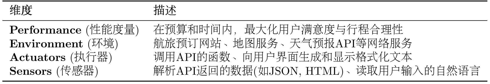

**图 2.2 物理符号系统的构成元素**（板 4 备选）

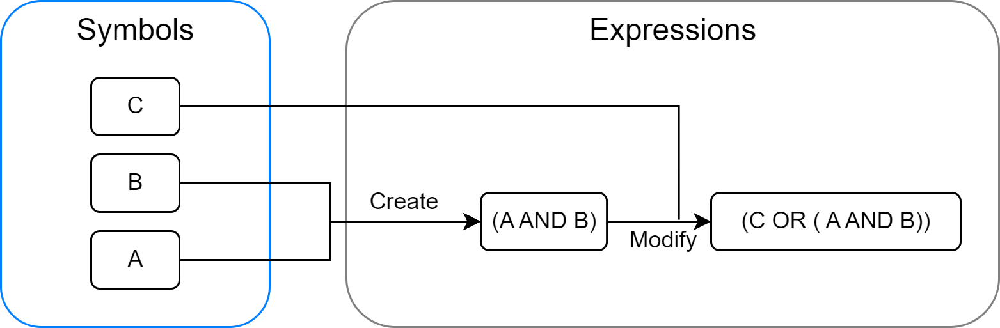

**图 2.3 专家系统的通用架构**（板 4 备选）

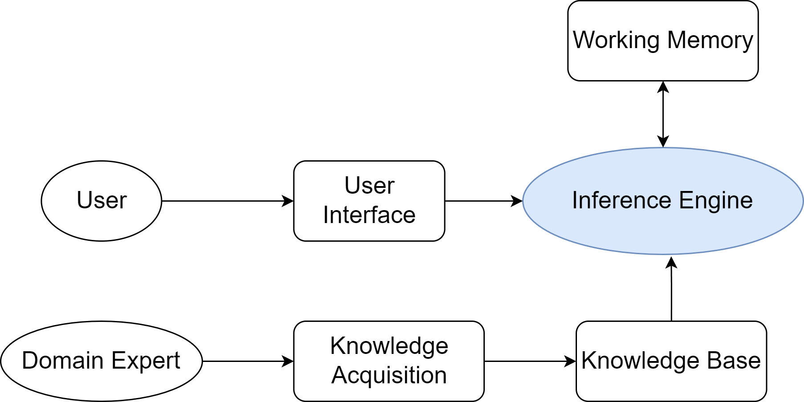

**图 2.4 MYCIN 反向链推理流程**（板 4）


**图 2.5 SHRDLU 的"积木世界"交互界面**（板 4 备选）

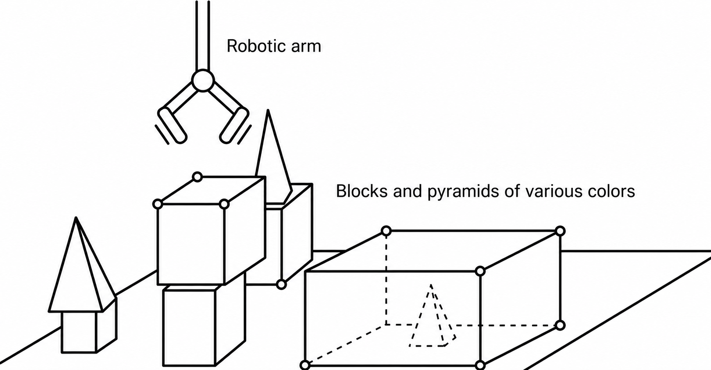

**图 2.6 "心智社会"中搭积木塔行为的涌现机制**（板 4）


**图 2.7 符号主义与联结主义范式对比**（板 4 备选）

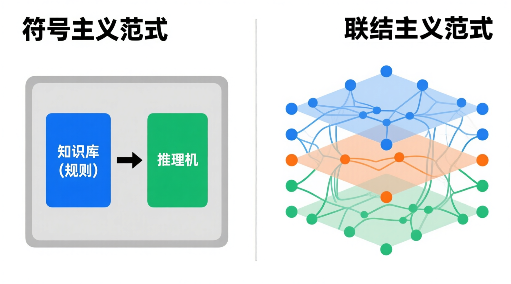

**图 2.9 "预训练-微调"范式示意图**（板 4）


**图 3.1 马尔可夫假设示意图**（板 5）


**图 3.2 神经网络语言模型架构示意图**（板 5）


**图 3.3 RNN 结构示意图**（板 5）


**表 3.1 BPE 算法合并过程示例**（板 6）


